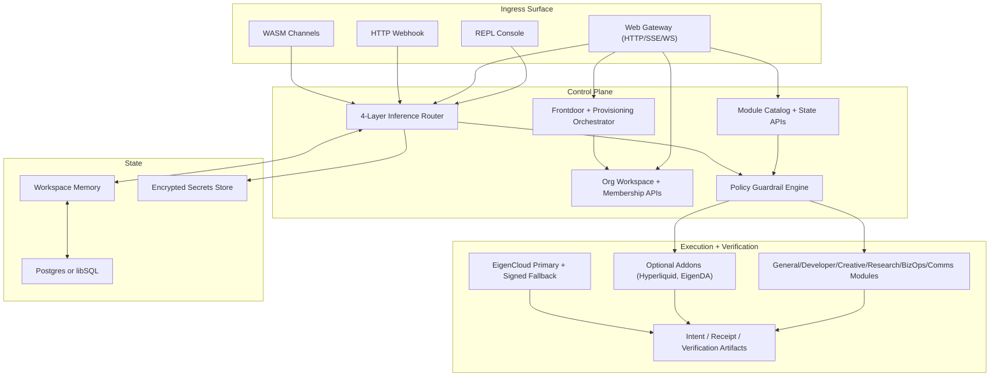

# Enclagent Architecture

Canonical high-level architecture for the Enclagent runtime.

Core references:

- `src/platform/mod.rs`
- `src/channels/web/server.rs`
- `src/channels/web/frontdoor.rs`
- `src/channels/web/types.rs`
- `src/agent/intent.rs`
