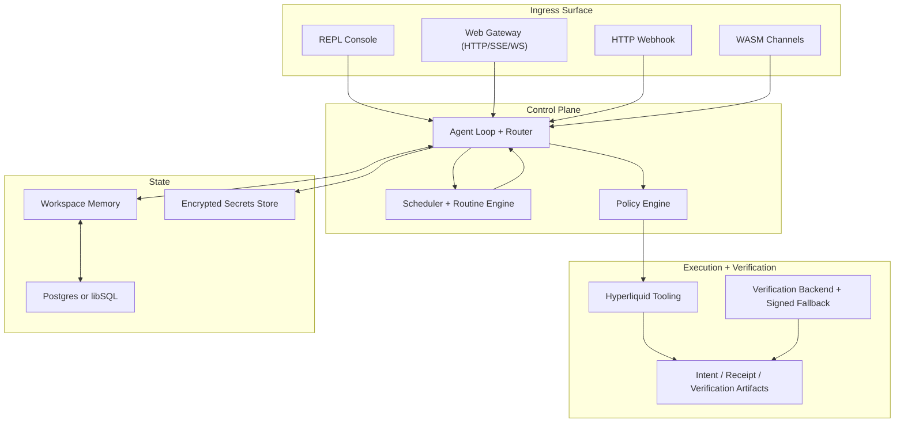

# Enclagent Architecture

Canonical high-level architecture for the Enclagent runtime.

Core references:

- `src/channels/web/server.rs`
- `src/channels/web/frontdoor.rs`
- `src/agent/intent.rs`
- `src/tools/hyperliquid.rs`
