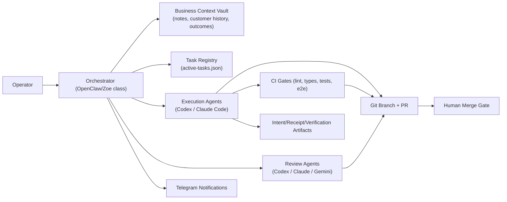
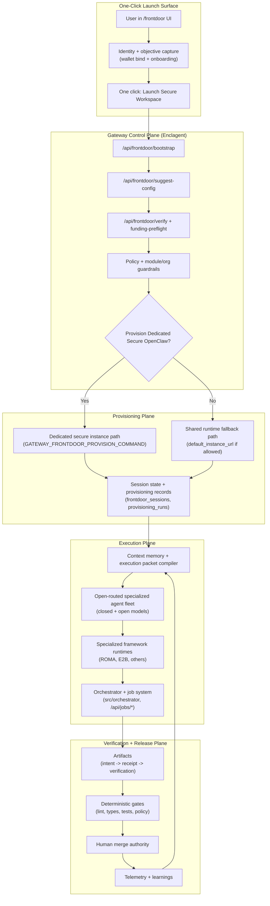

# Enclaved IronClaw Swarm Orchestration

Status: Operational runbook
Last updated: 2026-02-27

## Purpose

Define a deterministic, verifiable multi-agent delivery pattern for Enclagent IronClaw-lineage enclaves where:

- OpenClaw (or equivalent) is the orchestration layer.
- Codex and Claude Code are execution agents.
- Additional models (for review or design) are routed as specialist agents.
- Human review remains the merge authority.

## Why This Pattern Exists

Single-agent workflows collapse when one prompt must carry both:

- Full business context (customer history, sales context, prior failures, meeting notes).
- Full code context (types, interfaces, tests, runtime constraints).

Context windows are finite. Enclaved orchestration separates concerns:

- Orchestrator tier holds business and operational context.
- Execution tier receives constrained, code-task prompts only.
- Verification tier checks artifacts and policy gates before merge.

## Architecture for Enclaved IronClaw Instances



## One-Click Secure OpenClaw System Map



Codebase alignment:

- Launch/control/provisioning map to `src/channels/web/frontdoor.rs`, `src/channels/web/server.rs`, and `scripts/provision-user-ecloud.sh`.
- Runtime execution maps to `src/orchestrator/`, `src/worker/`, and `/api/jobs/*`.
- Governance maps to deterministic validation gates plus persisted verification artifacts.

## Responsibility Split

| Tier | Primary responsibility | Allowed context | Prohibited context |
|---|---|---|---|
| Orchestrator | Scope tasks, write prompts, route models, monitor retries, notify humans | Customer context, meeting notes, prod metadata, failure history | None of the execution-only constraints |
| Execution agent | Implement code changes and tests in isolated branch/worktree | Codebase slice, issue scope, acceptance criteria | Raw production credentials, unrestricted customer data |
| Review agent | Find defects, regressions, security/scalability issues | PR diff, tests, CI signals | Write access to production systems |
| Human operator | Final risk acceptance and merge decision | Complete PR evidence | None |

## Security and Verifiability Constraints

- Keep addon modules disabled by default unless policy enables them.
- Keep non-trading workflows available without trading modules.
- Block live-order actions unless signer and policy gates are satisfied.
- Persist `IntentEnvelope -> ExecutionReceipt -> VerificationRecord` for in-scope actions.
- Keep signed fallback verification available when primary verification backend degrades.
- Restrict production DB access to orchestrator-managed, read-only credentials.
- Never pass production admin credentials to execution agents.

## 8-Step Execution Workflow (Enclave-Adapted)

1. Customer signal intake and scoping in orchestrator.
2. Orchestrator synthesizes task prompt from business context + code context.
3. Orchestrator spawns isolated agent runtime (worktree + tmux or enclave job).
4. Deterministic monitor loop evaluates session, PR, CI, and review states.
5. Agent opens PR and syncs branch with `main`.
6. Multi-model review runs (edge cases, security/scalability, correctness).
7. CI and policy gates enforce lint/types/tests/E2E + UI evidence.
8. Human performs final review, merges, and triggers cleanup.

## Spawn Pattern

Worktree + tmux model (example):

```bash
git worktree add ../feat-custom-templates -b feat/custom-templates origin/main
cd ../feat-custom-templates && pnpm install

tmux new-session -d -s "codex-templates" \
  -c "/path/to/worktrees/feat-custom-templates" \
  "$HOME/.codex-agent/run-agent.sh templates gpt-5.3-codex high"
```

Mid-task redirection stays in-session:

```bash
tmux send-keys -t codex-templates "Stop. Focus on API layer first, then UI." Enter
tmux send-keys -t codex-templates "Use schema in src/types/template.ts." Enter
```

## Deterministic Task Registry

Track active work in a machine-readable registry (example: `.clawdbot/active-tasks.json`):

```json
{
  "id": "feat-custom-templates",
  "tmuxSession": "codex-templates",
  "agent": "codex",
  "description": "Reusable customer configuration templates",
  "repo": "enclagent",
  "worktree": "feat-custom-templates",
  "branch": "feat/custom-templates",
  "startedAt": 1740268800000,
  "status": "running",
  "notifyOnComplete": true,
  "attempts": 0
}
```

Terminal state contract:

```json
{
  "status": "done",
  "pr": 341,
  "completedAt": 1740275400000,
  "checks": {
    "prCreated": true,
    "ciPassed": true,
    "codexReviewPassed": true,
    "claudeReviewPassed": true,
    "geminiReviewPassed": true
  },
  "note": "All checks passed. Ready to merge."
}
```

## Monitoring Loop (Every 10 Minutes)

The loop reads registry state and performs deterministic checks:

- Session/process is alive.
- PR exists for tracked branch.
- Branch is mergeable with current `main`.
- CI status is green.
- Review comments contain no unresolved critical issues.
- Retry count remains under policy limit (for example, max 3).

Failure handling:

- If recoverable, orchestrator sends focused correction prompt to active session.
- If non-recoverable or retries exhausted, escalate to human with exact blocker.

## Definition of Done for Enclaved IronClaw PRs

PR is merge-ready only when all conditions are true:

- PR exists and branch is pushed.
- Branch is synchronized with latest `main`.
- CI gates pass.
- `npm run lint` passes.
- Review gates pass (Codex, Claude, Gemini or policy-equivalent stack).
- UI changes include screenshot evidence in PR description.
- Required policy/verifiability checks are green for affected surfaces.
- Human reviewer approves final merge.

## Retry Strategy (Ralph Loop V2 Adaptation)

Do not respawn with the same prompt. On each failure:

1. Classify failure (`context_gap`, `wrong_direction`, `missing_constraint`, `test_regression`).
2. Inject only missing context required to unblock the current failure.
3. Narrow scope aggressively (explicit files, interfaces, expected tests).
4. Re-run validation gates and record outcome pattern in orchestrator memory.

The orchestrator improves prompt quality by learning from pass/fail outcomes tied to merge success.

## Recursive Self-Improvement Play

Use a controlled outer loop that improves orchestration strategy without allowing unsafe self-modification.

Loop inputs:

- CI outcomes (`pass`, `fail`, failure class)
- reviewer findings severity
- restart/retry counts
- time-to-green and time-to-merge
- post-merge regression incidents

Deterministic reward signal per strategy variant:

- positive for green CI, low critical findings, low retries, short lead time
- negative for failed CI, critical review defects, regressions, rollback events

Allowed self-modifications:

- prompt templates and instruction ordering
- model-routing weights by task type
- retry playbook text and scoped file hints
- test-path and validation-hint injection rules

Prohibited self-modifications:

- policy guardrails and signer gates
- secrets handling and credential boundaries
- verification backend/fallback safety posture
- merge authority (must remain human-controlled)

Execution cycle:

1. Snapshot current baseline strategy.
2. Generate candidate strategy changes.
3. Run canary tasks on a bounded subset.
4. Compare candidate score vs baseline.
5. Promote only if score improves and safety constraints remain green.
6. Roll back immediately on regression trigger.
7. Persist learning record (`hypothesis`, `change`, `result`, `decision`) in orchestrator memory.

Regression triggers (auto-rollback):

- increased critical findings rate
- increased post-merge defect rate
- increased failed CI rate
- policy/safety gate violation

ROMA integration for candidate decomposition/planning should follow `docs/ROMA_FORK_INTEGRATION_BLUEPRINT.md`.

This yields recursive improvement while preserving enclave verifiability and security invariants.

## Agent Routing Policy

| Task shape | Default model | Reason |
|---|---|---|
| Backend logic, multi-file refactor, bug with hidden edge cases | Codex | Stronger cross-file reasoning and lower false-positive review rate |
| Fast UI implementation, straightforward git plumbing | Claude Code | Faster turnaround and practical terminal workflow |
| UI concept/spec generation | Gemini (spec) + Claude Code (implementation) | Better design ideation with deterministic implementation handoff |

## Resource Ceiling and Capacity Planning

Common bottleneck is memory pressure from parallel worktrees and test/build concurrency.

- Each active agent can trigger independent dependency trees, compilers, and test runners.
- 16GB systems typically saturate at low parallelism under heavy TypeScript/test workloads.
- High-concurrency operation requires aggressive memory headroom and controlled parallel CI/build execution.

Practical controls:

- Cap concurrent heavy tasks.
- Serialize expensive validation stages when memory pressure rises.
- Reuse dependency caches aggressively.
- Enforce per-agent memory limits in containerized execution modes.

## Operational Metrics

Use these as governance signals, not vanity metrics:

- Lead time from scoped request to merge-ready PR.
- Retry count per task before green CI + review.
- Merge success rate without manual rework.
- Defect escape rate after merge.
- Token and infrastructure cost per merged PR.

Example field benchmark from one operator setup:

- Peak output: 94 commits in one day.
- Typical output: ~50 commits per day.
- Fast burst: 7 PRs in 30 minutes.
- Tooling cost: approximately $190/month (can start lower).

## Enclagent Surface Mapping

This runbook aligns with existing Enclagent surfaces:

- Orchestrator core: `src/orchestrator/`
- Worker runtime: `src/worker/`
- Job APIs: `/api/jobs/*` in `src/channels/web/server.rs`
- Frontdoor provisioning/verification: `docs/FRONTDOOR_ENCLAVE_FLOW.md`
- Local validation gates: `docs/LOCAL_VERIFICATION.md`
- Telegram channel setup: `docs/TELEGRAM_SETUP.md`

## Implementation Baseline

- Keep orchestration deterministic, inspectable, and policy-gated.
- Keep business-context routing in the orchestrator tier.
- Keep execution agents isolated and least-privileged.
- Keep merge authority human-controlled with objective evidence.

## ROMA Extension

For ROMA fork decomposition integration, use:

- `docs/ROMA_FORK_INTEGRATION_BLUEPRINT.md`
