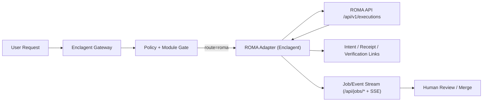

# ROMA Fork Integration Blueprint

Status: Design ready for implementation
Last updated: 2026-02-27

## Scope

Integrate the vendored `ROMA/` framework into Enclagent as an optional orchestration addon without weakening:

- verifiable intent/receipt/proof lineage
- policy gating and secrets boundaries
- existing Enclagent orchestrator and job APIs

## Local Baseline

Current repository already includes:

- Enclagent runtime orchestrator: `src/orchestrator/`
- Enclagent sandbox job APIs: `/api/jobs/*` in `src/channels/web/server.rs`
- ROMA framework fork: `ROMA/` (CLI + FastAPI at `/api/v1/executions`)

No native Enclagent-to-ROMA adapter exists yet.

## Recommended Integration Mode

Use ROMA as a sidecar decomposition service behind Enclagent policy gates.

Rationale:

- keeps Rust runtime boundaries stable
- avoids Python dependencies in Enclagent worker images
- allows strict network/auth controls
- enables deterministic mapping of ROMA execution IDs into Enclagent receipts

## Reference Flow

## API Contract Mapping

| Enclagent action | ROMA endpoint | Notes |
|---|---|---|
| Start decomposed execution | `POST /api/v1/executions` | send `goal`, `max_depth`, `config_profile`, optional metadata |
| Poll execution status | `GET /api/v1/executions/{execution_id}/status` | poll until terminal state |
| Fetch execution detail | `GET /api/v1/executions/{execution_id}` | include DAG/statistics in Enclagent receipt |
| Cancel execution | `POST /api/v1/executions/{execution_id}/cancel` | map cancellation into Enclagent job lifecycle |

ROMA status set: `pending`, `running`, `completed`, `failed`, `cancelled`.

## Status Mapping to Enclagent Job UI

| ROMA status | Enclagent state |
|---|---|
| `pending` | `pending` |
| `running` | `in_progress` |
| `completed` | `completed` |
| `failed` | `failed` |
| `cancelled` | `interrupted` |

## Verifiability Mapping

For each ROMA-routed task:

1. Create Enclagent intent artifact before calling ROMA.
2. Store ROMA `execution_id` in execution receipt metadata.
3. Persist terminal receipt with status, summary metrics, and completion timestamp.
4. Store verification linkage in `verification_artifact_links` with deterministic hash inputs:
- user/task identity
- ROMA execution_id
- terminal status
- selected profile/max_depth
- final result digest

## Security Controls

- ROMA endpoint must be explicit allowlist target.
- ROMA auth key must live in encrypted secrets storage, never prompt text.
- Execution agents do not receive direct ROMA database credentials.
- Route-to-ROMA must be policy-controlled and auditable.
- Fail closed on ROMA adapter timeout/auth failures.

## Integration Phases

### Phase P0: Operational Sidecar (No Rust code changes)

- Run ROMA API from `ROMA/` stack.
- Route selected tasks manually via orchestration scripts.
- Keep Enclagent as system of record for merge and policy decisions.

### Phase P1: Native Enclagent ROMA Adapter

Add optional gateway adapter layer:

- Config surface:
  - `src/config/mod.rs`
  - `src/config/channels.rs` (or dedicated config module)
- Typed request/response models:
  - `src/channels/web/types.rs`
- Adapter handlers:
  - `src/channels/web/handlers/` (new ROMA handler module)
- Routes:
  - `src/channels/web/server.rs`

Recommended internal endpoints:

- `POST /api/roma/executions`
- `GET /api/roma/executions/{execution_id}`
- `GET /api/roma/executions/{execution_id}/status`
- `POST /api/roma/executions/{execution_id}/cancel`

### Phase P2: Job-System Binding

- Add ROMA-backed job mode metadata in sandbox job records.
- Stream ROMA status transitions into existing job event pipeline.
- Keep restart/cancel semantics consistent with existing `/api/jobs/{id}/*`.

## Proposed Environment Contract

Use these variables for adapter configuration:

- `ROMA_API_ENABLED` (`true|false`)
- `ROMA_API_BASE_URL` (example: `http://127.0.0.1:8000`)
- `ROMA_API_KEY` (optional auth if fronted by gateway/proxy)
- `ROMA_DEFAULT_PROFILE` (example: `general`)
- `ROMA_DEFAULT_MAX_DEPTH` (example: `2`)
- `ROMA_POLL_INTERVAL_MS` (example: `2000`)
- `ROMA_REQUEST_TIMEOUT_MS` (example: `30000`)

## Acceptance Criteria

- Enclagent can start and track ROMA executions via typed API.
- ROMA terminal states map deterministically into Enclagent job states.
- Every ROMA-routed execution emits intent/receipt/proof links.
- Policy gates and secret boundaries remain intact.
- Local validation remains green (`npm run lint`, Rust checks).

## Rollback

- Set `ROMA_API_ENABLED=false`.
- Keep default routing on Enclagent native execution path.
- Preserve stored receipts and verification links for prior ROMA runs.
